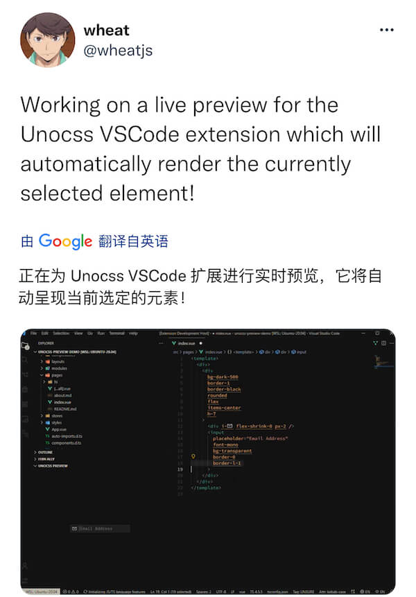

## 今日句子

## 原文

> Working on a live preview for the Unocss VSCode extension which will automatically render the currently selected element!
> [查看原文](https://twitter.com/wheatjs/status/1496198656466341895)

## 翻译

> 作者正在从事开发一个 `Unocss VSCode` 扩展插件，它能实时预览和查看当前正在开发的元素!

## 单词

- work on：影响，对...起作用；继续工作；从事与...; 设法说服
- live preview: 实时预览

## 技术 - Unocss

[Unocss](https://github.com/unocss/unocss) 是一个开源的项目，它的项目介绍是这样的：

> The instant on-demand atomic CSS engine.

> 及时按需的原子化 `CSS`

通过上面简短的说明，很难理解原子化 `CSS` 是什么，所以作者通过 [Reimagine Atomic CSS (EN)](https://antfu.me/posts/reimagine-atomic-css) [重新构想原子化 CSS (中文)](https://antfu.me/posts/reimagine-atomic-css-zh) 详细进行了说明。
