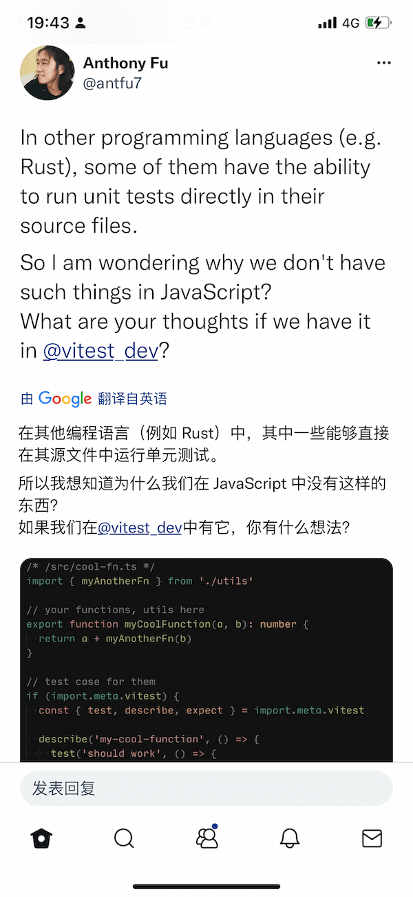

## 今日句子



## 原文

> In other Programming languages (e.g.Rust), some of them have the ability to run unit tests directly in their source file.<br/>
> So I am wondering why we don't have such things in JavaScript?<br/>
> What are you thoughts if we have it in @vitest_dev?
> [查看原文](https://twitter.com/antfu7/status/1500377124267429890)

## 代码

```javascript
/* /src/cool-fn.ts */
import { myAnotherFn } from './utils'
export function myCoolFunction(a, b): number {
  return a + myAnotherFn(b)
}
// test case from them
if (import.meta.vitest) {
  cons { test, describe, expect } = import.meta.vitest

  describe('my-cool-fn', () => {
    test('should work', () => {
      expect(myCoolFunction(1, 2)).toBe(3)
    })
  })
}
```

## 翻译

> 在其他编程语言中（例如 Rust），它们有的可以直接在源文件中运行单元测试。<br/>
> 所以我很好奇，为什么我们不能在 `JavaScript` 中做类似的事情？<br/>
> 如果我们在 @vitest_dev 中拥有它，你有什么样的想法？
> [查看原文](https://twitter.com/antfu7/status/1500377124267429890)

## 单词

- ability: n.能力，能够；才能，技能，本领；
- wondering:
  - v.想知道；不知道；赶到疑惑；感到诧异；
  - adj. 感到着迷的；觉得惊奇的；好奇的；

## 技术 - vitest

[vitest](https://github.com/vitest-dev/vitest) 是一个基于 Vite 的测试框架，它是非常快的！
