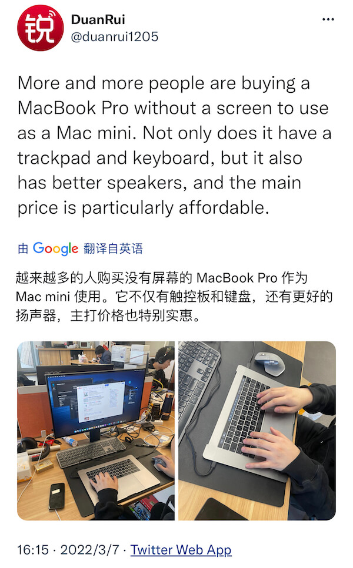

## 今日句子

## 原文

> More and more people are buying a MacBook Pro without a screen to use as a Mac mini. Not only does it have a trackpad and keyboard, but it also has better speakers, and the main price is particularly affordable.
> [查看原文](https://twitter.com/duanrui1205/status/1500747070093008899)

## 翻译

> 越来越多的人买没有屏幕的 MacBook Pro，把它当做 Mac mini 使用。它不仅有触控板和键盘，而且还有更好的扬声器，并且最主要的是价格非常的便宜。
> [查看原文](https://twitter.com/duanrui1205/status/1500747070093008899)

## 单词

- More and more: 越来越多；
- without:
  - prep.没有，缺乏；不使用，不借助；在没有的情况下；不和...在一起，无...相伴
  - adv.没有，缺乏；在外面
  - n.外部，外面；
- trackpad：n.触控板；轨迹板；
- speakers: n.扬声器；发言者；演说家；
- particularly: adv.非常，尤其；特别是；清楚地，明确的；
- affordable: adj.便宜的，付得起的；

## 技术 - MacBook Pro

[MacBook Pro](https://www.apple.com.cn/macbook-pro/) 是苹果公司于 2006 年 1 月推出的 Mac 笔记本电脑系列（我现在用的也是 2017 款 13 英寸的 MacBook Pro）。
