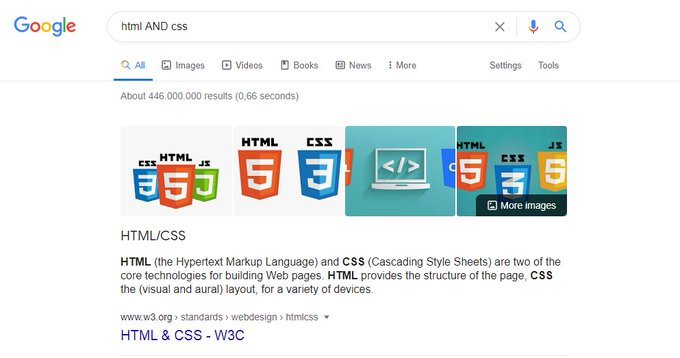
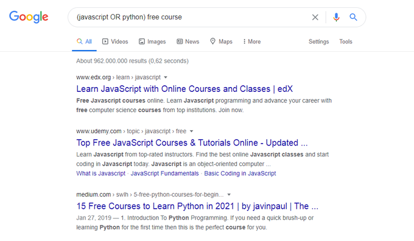

## 今日句子

Google is the most powerful tool in the world if you know how to use it property. 
Here are 10 Google tips that will make you a pro!👇[查看原文](https://twitter.com/denicmarko/status/1506953132567412737) 

> Google 是世界上最强大的工具，如果你知道怎样去使用它的特性。 
> 这里有 10 个 Google 小技巧，它将是你变成的更专业！👇

1.Use quotes to force an exact-match search: "what is javascript"

> 使用引号将强制精确搜索：“JavaScript 是什么”（尝试发现必须是双引号，单引号不会精确搜索）

---

2.AND operator will return only results related to both terms: html AND css

> AND 运算符只会返回两个术语相关的结果：html AND css

---

3.You can use the OR operator to get the results related to one of the search terms: (javascript OR python) free course

> 你能使用 OR 运算符得到与其中一个搜索术语相关的结果：(javascript 或者 python) 的免费教程

---

4.'-' operator will exclude results that contain a term or phrase: javascript -css

> '-' 运算符将从搜索中排除包含术语或短语的结果：搜索 JavaScript，但是排除掉包含 css 的结果。

---

5.You can use the (\*) wildcards as placeholders,which will be replaced by any word or phrase:"how to start \* in 6 months"

> 你能使用 (\*) 通配符作为一个占位符号，它将代替任何单词和短句：如何在六个月内（创办一家成功的软件公司|开启一段美好的恋爱 👫🏻）。

